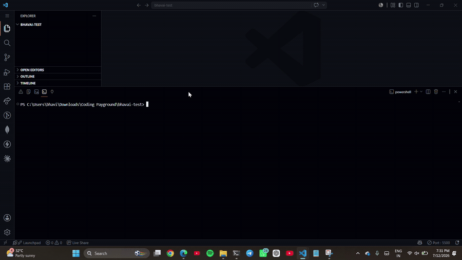

BhavAI is a production-ready, lightweight, personal terminal AI agent powered exclusively by the **Sarvam-105B LLM API**. It operates directly within your current working directory, following a robust **Reason → Act → Observe** (ReAct) loop to solve complex tasks.


```
git stash list
git stash apply
```


---

## 🌟 Key Features

- **Dual Operating Modes**:
  - **Plan Mode** (Default): Outlines a numbered, step-by-step checklist and requests confirmation (`y/n`) before executing any actions.
  - **Agent Mode**: Autonomously executes tasks sequentially, displaying thoughts and tool calls in real-time.
- **Strict Hard Safeguards**:
  - **Zero-Deletion Policy**: Hardcoded constraints prevent file or directory deletions (e.g., `rm`, `unlink`, `shutil.rmtree` are blocked).
  - **Sandboxed Scope**: Validates all paths to ensure operations cannot access, read, or write to any location outside the activated working directory.
  - **Command Blocklist**: Automatically intercepts and blocks dangerous commands.
- **Rich Terminal UI**:
  - Beautiful progress indicators, panel layouts, syntax-highlighted code blocks, and markdown renderings using Python's `rich` library.
- **Gitignore-Aware Tree Mapping**: Indexes the current workspace at startup while respecting your `.gitignore` configuration (ignores `node_modules`, `.git`, `__pycache__`, etc.).

---

## 🛠️ Installation & Setup

### 1. Prerequisites
- Python 3.11 or higher installed on your system.

### 2. Global Package Installation
To make `bhav` available globally on your terminal, clone the repository, navigate to the folder, and run:
```bash
pip install -e .
```
This installs the package in editable mode and sets up the global entry point.

### 3. API Key Setup
Create a `.env` file in the folder you wish to work in (or your home directory) with your Sarvam API Key:
```env
SARVAM_API_KEY=your_sarvam_api_key_here
```
To obtain an API key, sign up on the [Sarvam AI Dashboard](https://dashboard.sarvam.ai/).

---

## 🚀 Usage Guide

To activate BhavAI in any terminal folder, navigate to it and run:
```bash
bhav wake up
```

This launches the interactive session. 

### Interactive Commands
Within the session, you can run prompts or commands:
```bash
> review the folder structure
> what is written in the README file?
> create a file script.py with a simple flask app
> mode agent          # Switch to Agent Mode
> mode plan           # Switch to Plan Mode
> exit                # Exit BhavAI (or use 'quit')
```

---

## 🏗️ Architecture

```
BhavAI Terminal Edition
│
├── 📁 assets
│   ├── 🖼️ demo.gif
│   └── 🎨 palette.png
│
├── 📁 bhavai
│   ├── 📁 core
│   │   └── 💬 messages.py               # Shared messages & prompts
│   │
│   ├── 📁 scripts
│   │   └── 📄 initialize_markdown.py
│   │
│   ├── 📁 updater
│   │   └── 🔄 updates.py
│   │
│   ├── 📄 __init__.py                  # Package initialization
│   ├── 🤖 agent.py                     # Core ReAct loop runner
│   ├── 🌐 api.py                       # API utilities
│   ├── ⚙️ config.py                    # Configuration & logger
│   ├── 📋 config_schema.py             # Configuration schema
│   ├── 🌲 context.py                   # Gitignore-aware context builder
│   ├── 🚀 main.py                      # CLI entry point & interactive REPL
│   ├── 🧠 memory.py                    # Session conversation memory
│   ├── 🎯 modes.py                     # Plan / Agent mode logic
│   ├── 🔧 settings_router.py           # Settings router
│   ├── 🛠️ skill_getter.py              # Skill loader
│   ├── 🧩 skills_router.py             # Skill router
│   ├── 🧪 test_tools_extended.py       # Extended tool tests
│   ├── 🔨 tools.py                     # Core sandboxed tools
│   ├── ⚡ llm.py                       # Sarvam & Groq LLM interface
│   ├── 🧰 tools_extended.py            # Additional tools
│   └── 💻 tui.py                       # Terminal UI
│
├── 📁 tests
│   └── 🧪 test_tools.py
│
├── 🚫 .gitignore
├── 📘 BHAVAI.md
├── 🎬 demo.gif
├── 📜 LICENSE.md
├── ⚒️ make.py
├── 🔑 .env.example                     # Environment variables template
├── 🎨 palette.png
├── 📦 pyproject.toml                   # Package configuration
├── 📖 README.md                        # Project documentation
└── 🚶 WALKTHROUGH.md                   # Getting started guide
```

---

## 🛡️ Blocked Actions
The following command prefixes/substrings are completely banned from execution:
`rm`, `rmdir`, `del`, `unlink`, `shutil.rmtree`, `os.remove`, `format`, `mkfs`, `drop table`.
Any attempt to access parent directories via relative pathways (`../`) or absolute referencing outside the workspace is denied.

---

## 🧪 Running Tests
To run unit tests for tools, blocklists, and sandboxing:
```bash
pytest tests/
``` 
